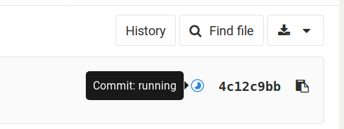

Mif01 - TP Maven-Git-Forge
==========================

Objectif
--------

Mettre en place et maitriser les outils de gestion de code utilisés tout
au long de l’année.

-   Outil de build avec Maven (mvn)
-   Outil de versioning avec Git (git)
-   Outil de gestion de projet avec Gitlab (la Forge)

Déroulement
-----------

Ce TP est à réaliser de préférence sous Linux (accès à `mvn` et `git`
en ligne de commande). L’utilisation d’IDE est n’est pas recommandée
pour ce TP.

Sur les machines de Lyon 1, Maven n'est pas installé sous Windows.
Vous pouvez tout de même travailler sous Windows mais vous devrez
[installer Maven sur votre
compte](https://www.mkyong.com/maven/how-to-install-maven-in-windows/).
Vous pouvez aussi travailler sous Linux pour les manipulations avec
`mvn`.

Pour les TPs suivants, vous pourrez travailler avec un IDE (Eclipse
avec plugin m2e et IntelliJ sont installés sous Windows à Lyon 1).

## Démarrage

### Installations

Vérifiez que vous avez bien `git` et `mvn` installés :

```
$ git --version
git version 2.17.0
$ mvn --version
Apache Maven 3.5.2
[...]
```

Si ce n'est pas le cas installez-les. Sous Ubuntu, faire :

```
apt install git maven
```

### Création d'un projet sur la forge

Ouvrez dans votre navigateur
[forge.univ-lyon1.fr](http://forge.univ-lyon1.fr). Si vous vous
connectez pour la première fois, le système vous permettra de
vérifier/modifier les informations qui vous concernent, idem pour
votre éventuel binôme. Ajoutez ce dernier comme développeur de votre
projet (Configuration → Membres).

Nous allons utiliser le dépôt Git du cours comme base pour votre
projet. Ouvrez la page
[https://forge.univ-lyon1.fr/matthieu.moy/m1if01](https://forge.univ-lyon1.fr/matthieu.moy/m1if01),
et cliquez sur le bouton « fork ». Ce bouton vous permet de récupérer
une copie du projet sur votre espace de la forge.

**IMPORTANT**: pour l'instant, le fork de votre projet est public sur
la forge. Nous vous demandons **impérativement de passer ce projet en
« privé »** pour que vos collègues ne puissent pas recopier votre code.
En cas de copie, nous sanctionnerons les étudiants ayant copié **et**
ceux ayant laissé copier leur code. Pour rendre votre projet privé,
rendez-vous dans « settings → general » en bas de la barre latérale de
gauche, puis « Permissions ». Le premier réglage est « Project
visibility ». Dans le menu, choisissez « private », puis cliquez sur
le bouton « save changes ».

Pour vérifier que votre projet est bien privé (indispensable),
retournez à la page d'accueil de votre projet
(`https://forge.univ-lyon1.fr/votre.nom/m1if01`) et copiez l'URL.
Ouvrez une fenêtre de navigation privée
(<kbd>Control</kbd>+<kbd>Shift</kbd>+<kbd>P</kbd> sous Firefox,
<kbd>Control</kbd>+<kbd>Shift</kbd>+<kbd>N</kbd> sous Chrom{e,ium}), et collez l'URL de votre projet
dans la barre d'URL. Comme le projet est privé, vous devez avoir le
message « You need to sign in or sign up before continuing. ». Si ce
n'est pas le cas, vous avez raté quelque chose, recommencez la
manipulation.

Pour vos projets futurs, vous pourrez aussi créer des projets à partir
de zero. Pour cela, vous pourrez faire simplement « new project »
(bouton **+** en haut de l'écran).

### Configuration de base de Git

Vous pouvez passer directement à la section suivante si vous avez déjà
configuré Git sur votre machine.

Sur votre ordinateur, dans un terminal, ajoutez les informations de base
à votre compte git (les données seront rangées dans un fichier
`~/.gitconfig`, que vous pouvez aussi éditer à la main si vous
préférez) :

```
git config --global core.editor "votre_editeur_prefere"
git config --global user.name "Nom Prenom"
git config --global user.email "votre_email@etu.univ-lyon1.fr"
```

La première ligne spécifie l'éditeur de texte à utiliser pour saisir
les messages de commits. Vous pouvez spécifier par exemple `emacs` ou
`vim`. Si vous utilisez gvim, écrivez ici `gvim -f` et si vous
utilisez gedit, `gedit -s` (Si un `gvim` est déjà
lancé, la commande `git commit` va se connecter au `gvim` déjà
lancé pour lui demander d'ouvrir le fichier, et le processus lancé par
`git` va terminer immédiatement. Git va croire que le message de
commit est vide, et abandonner le commit. Utiliser `gvim -f`
permet d'ouvrir une nouvelle instance de gvim ce qui règle le
problème).

Les lignes suivantes seront utilisées pour le champ « auteur » des
commits que vous ferez. Utilisez votre vrai nom (pas votre login) et
votre adresse email.

### Clone du projet

Toujours dans un terminal, déplacez vous dans le dossier ou vous
souhaitez créer le projet, et clonez votre dépôt git. L’URL de votre
dépôt est accessible dans Gitlab depuis la page du projet. Si vous
avez l'habitude d'utiliser des clés SSH et des tunnels SSH, vous
pouvez choisir l'URL SSH. Sinon, l'URL HTTPS sera plus pratique.

```
git clone https://forge.univ-lyon1.fr/votre.nom/votre-projet.git
```

[En cas de problème, voir la faq de la
forge](https://forge.univ-lyon1.fr/EMMANUEL.COQUERY/forge/wikis/FAQ), et
le guide de Titouan Chary (M2) pour [accéder à la forge depuis
l’extérieur](https://forge.univ-lyon1.fr/tchary/transparent_forge).

Ce projet est constitué d’un projet maven (nommé `poneymon_fx` dans le
fichier `pom.xml`).

Pour vous assurer que votre environnement est opérationnel, faites une
modification triviale (par exemple adapter l'URL de votre projet dans
`pom.xml`), puis faites un commit et un push:

```
git status
git add pom.xml
git commit
git push
```

Dans le navigateur, naviguez dans le dépôt: vous pouvez voir les
révisions déjà présentes et même regarder le code source en ligne, ainsi
que les différences entre les révisions.

## .gitignore et gestion d’un ticket

Les utilitaires comme Maven génèrent un grand nombre de fichiers qu'ils ne
faut pas ajouter à vos dépôts. Vous allez donc configurer ce projet de
manière à les ignorer. Pour cela vous allez utiliser en plus l'outil de
gestion de tickets.

Depuis l'interface web de la forge, créez une nouvelle demande (*issue*)
intitulée: “ignorer le répertoire target”. Ce dossier `target` sera créé par
Maven au moment du build, et contiendra les fichiers `.class` et le jar.

Accédez à la liste des demandes de votre projet puis modifiez la demande
précédente en assignant un des membres du projet à cette tâche. Notez bien
le numéro `#xxxx` de la demande (sans doute #1).

Créez un fichier `.gitignore` à la base du répertoire `poneymon_fx` et
ajoutez-y les lignes suivantes :

```
# Ignore les fichiers de configuration d'Eclipse
.classpath
.project
.settings/

# Ignore les fichiers de configuration d'Intellij
.idea/
*.iml
*.iws

# Ignore les fichiers produits par Maven pour ne versionner que le code,
# pas les executables ou les logs.
log/
target/
```

Ce fichier contient la liste des fichiers que git doit ignorer: la
commande `git status` ne les mentionnera pas dans la section
`Untracked files`, et la commande `git add` refusera par défaut de les
ajouter.

```
git status
```

n’affiche à présent plus les fichiers dans target, mais affiche le
fichier `.gitignore`. Ajoutez ce fichier dans les fichiers versionnés:

```
git add .gitignore
```

puis valider en indiquant le numéro de la demande \#xxxx dans le message
de commit:

```
git commit -m "Gestion des fichier à ignorer (fixes #xxxx)"
```

puis faire le push

```
git push
```

Dans le projet forge, allez voir le dépôt et cliquez sur le dernier
commit. Vous pouvez vérifier que le `#xxxx` est un lien vers votre
demande, et que la présence de `fixes #xxxx` dans un message de commit
a automatiquement fermé le ticket correspondant.

### Un gitignore local par utilisateur

Vous avez sans doute vos habitudes et vos outils qui vous font
manipuler des fichiers que vous ne voulez pas partager et donc ajouter
au `.gitignore` (par exemple, ignorer `*~` si votre éditeur de texte
laisse des `fichier~` en guise de backup, ou ignorer `.DS_Store` si
vous êtes sous Mac OS). Mais d'une part, vous voulez ignorer ces fichiers
pour tous vos projets (sans avoir à modifier le `.gitignore` de chaque
projet), et d'autre part vous ne voulez pas forcément faire gonfler le
`.gitignore` des projets auxquels vous contribuez avec des entrées qui
ne concernent pas les autres.

Pour cela, il existe un fichier `~/.config/git/ignore` (le créer s'il
n'existe pas). Mettez-y par exemple ce contenu :

```
# Emacs's backup files
*~

# Mac's .DS_Store
.DS_Store
```

## Invocation de maven

Regardez le code de la classe `poneymon_fx.....App`.

Invoquer

```
mvn compile
```

Si vous avez des erreurs en rapport avec JavaFX (c'est le cas sur les
machines de Lyon 1), lisez la section « Installation manuelle de
JavaFX » en bas de cette page.

à la racine du projet et constater que la construction du projet est
bien déclenchée.

Le répertoire target contient tout ce qui est généré par maven. Explorer
le contenu du répertoire, puis invoquer

```
mvn clean
```

Regarder ce qui a été supprimé.

On lancer les tests associés au projet avec:

```
mvn test
```

La phase de vérification doit renvoyer au moins une erreur : vos
enseignants sont taquins et vous ont volontairement fourni du code
avec un ou des défauts. Vous corrigerez ces défauts un peu plus tard.

En pratique on veut souvent nettoyer le dossier target, et relancer le
processus de build, tests compris :

```
mvn clean install
```

Pour lancer l’application en ligne de commande on utilise :

```
mvn compile
mvn exec:java
```

Ou bien, on peut lancer l'application via la commande `java` après
avoir généré le `.jar` avec `mvn install`:

```
# Pour cette fois, on autorise la construction du .jar même en
# présence d'erreur dans le tests et le style (-DskipTests
# -Dcheckstyle.skip) :
mvn -DskipTests  -Dcheckstyle.skip install

java -cp target/poneymon_fx-0.0.1-SNAPSHOT.jar fr.univ_lyon1.info.m1.poneymon_fx.App
```

## Packaging

Configurer le plugin `maven-assembly-plugin` pour
générer un jar exécutable incluant les bibliothèques utilisées (voir
[ici](http://stackoverflow.com/questions/574594/how-can-i-create-an-executable-jar-with-dependencies-using-maven)).

Tester en lancer java via

```
java -jar target/poneymon_fx-0.0.1-jar-with-dependencies.jar
```

## Gérer les conflits

Nous n’allons pas mettre en pratique la gestion de conflits dans ce TP,
mais c’est quelque chose qui arrive fréquement. La [documentation de Git
traite du
sujet](https://git-scm.com/book/fr/v2/Les-branches-avec-Git-Branches-et-fusions%C2%A0%3A-les-bases)),
et [Github a un guide expliquant plutôt bien les
choses](https://help.github.com/articles/resolving-a-merge-conflict-using-the-command-line/).

Pour télécharger la dernière version depuis le dépôt et la fusionner
avec votre version locale, faire :

```
git pull
```

Pour lancer la fusion de deux branches on utilise la commande merge :

```
git merge <branche-a-fusionner>
```

Le conflits interviennent souvent lors du pull d’une branche dans la
branche courante. Cette commande importe les modification de la branche
crée lors du pull dans la branche courante.

`git status` signale les fichiers en conflits. Editer ces fichiers
pour intégrer de manière cohérente les modifications effectuées dans
le deux branches. Une fois les modifications effectuées, si la
construction `mvn install` fonctionne, indiquer ques les conflits sont
résolus via

```
git add le_fichier_concerne
git commit
```

## Intégration continue avec GitLab-CI

### Principe

Le principe de l'intégration continue (Continuous Integration, CI) est
de maintenir une base de code opérationnelle en permanence. Pour cela,
on lance des tests (automatiques) le plus souvent possible.
[Gitlab-CI](https://docs.gitlab.com/ee/ci/quick_start/) permet de
lancer des tests à chaque push envoyé sur la forge. Un ensemble de
tests à lancer s'appelle un « pipeline » dans la terminologie GitLab.

Avant tout, vérifiez que les pipelines sont activés sur votre projet :

* Ouvrez la page d'accueil de votre projet dans votre navigateur.

* Dans la barre latérale de gauche, en bas, « Settings → General »,
  puis « permissions ». (Vous devriez retrouver « project visibility =
  private », si ce n'est pas le cas relisez le début de ce document,
  c'est important).
  
* Vérifiez que l'interrupteur « pipelines » est sur « enabled ».

* Si vous avez modifié quelque chose, cliquez sur « save changes ».

Il faut maintenant dire à GitLab quelle commande il doit lancer à
chaque push, et dans quel environnent. Cela se fait dans le fichier
`.gitlab-ci.yml` à la racine de votre projet Git. Un `.gitlab-ci.yml`
typique pour un petit projet ressemble à ceci :

```yaml
tests:
  image: ubuntu
  script:
  - ./my-test-script.sh
```

Avec cette configuration, le moteur d'intégration continue va lancer
le script `my-test-script.sh` dans un conteneur docker (sorte de
machine virtuelle) sur lequel est installé Ubuntu. Si
`my-test-script.sh` a un status de retour non-nul (par exemple s'il
termine par `exit 1`), on considère que les tests échouent.

### Mise en place

Pour notre projet, nous vous fournissons un `.gitlab-ci.yml` qui fait
un peu plus que cela :

* Utilisation d'une image docker sur laquelle Maven et JavaFX sont
  disponibles.
  
* Mise en cache du répertoire `.m2/repository`, pour éviter de
  re-télécharger toutes les dépendances à chaque pipeline.
  
* Configuration du proxy HTTP, qui est nécessaire sur la forge Lyon 1.

Ouvrez ce fichier dans votre éditeur de texte. La dernière ligne
(derrière `script:`) ne fait pour l'instant rien d'intelligent.
Remplacez-la par :

```
    - cd lab2-tools/poneymon_fx/ && mvn test --batch-mode
```

(Attention, l'indentation compte : cette ligne doit être indentée en
retrait de la ligne `script:` qui précède)

Faites un `commit` pour valider ce changement, et envoyez-le sur la
forge avec `git push`. Ouvrez la page d'accueil de votre projet dans
votre navigateur.

Le dernier commit est affiché, et vous devez maintenant avoir un
indicateur « commit: running » :



Au bout d'un certain temps, l'indicateur passera en rouge : le projet
que nous vous fournissons ne passe pas les tests !

Pour avoir une notification par email à chaque échec de pipeline,
choisissez dans la barre latérale : « Settings → Integrations », puis
« Pipelines emails ».

### Correction des défauts

Pour corriger les problèmes, le mieux est de travailler en local.
L'échec sur la forge se produit à l'exécution de la commande `mvn
test`, donc vous pouvez reproduire le problème en faisant `mvn test`
de votre côté.

Il y a deux choses à corriger :

* Un test échoue (vous devez avoir le message
  `Tests run: 2, Failures: 1, Errors: 0, Skipped: 0`). 
  Ouvrez le fichier `PoneyTest.java` et regardez rapidement son
  contenu. Un commentaire `TODO` vous dit ce qu'il faut corriger :
  faites-le et relancez les tests.

* Dans `Poney.java`, une erreur de style attrapée par le [plugin
  maven](https://maven.apache.org/plugins/maven-checkstyle-plugin/) de
  l'outil [checkstyle](http://checkstyle.sourceforge.net/). Supprimez
  l'espace en trop devant le point-virgule sur la déclaration de
  `X_INIT` et relancez les tests.
  
Une fois ces deux corrections faites, faites un commit et un push, et
vérifiez que l'intégration continue de la forge valide ce commit.

### Quelques détails sur le pom.xml

Si ce n'est pas déjà fait, parcourez le fichier `pom.xml`. C'est
verbeux (XML), mais il n'y a rien de sorcier. En pratique, on édite
rarement ce fichier entièrement à la main : soit on utilise un outil
automatique, soit on copie-colle et on adapte des portions de code
fournies sur le site des outils utilisés. Pour le cas qui nous
intéresse, les portions importantes sont :

Le plugin `exec-maven-plugin` pour lancer l'application :

```xml
  <plugin>
	<groupId>org.codehaus.mojo</groupId>
	<artifactId>exec-maven-plugin</artifactId>
	<version>1.5.0</version>
	<executions>
	  <execution>
	    <goals>
	      <goal>java</goal>
	    </goals>
	  </execution>
	</executions>
	<configuration>
	  <source>1.8</source>
	  <target>1.8</target>
	  <mainClass>fr.univ_lyon1.info.m1.poneymon_fx.App</mainClass>
	</configuration>
  </plugin>
```

L'important ici est de spécifier la classe principale (`<mainClass>`).

Les tests utilisent l'API JUnit :

```xml
  <dependencies>
    <!-- https://mvnrepository.com/artifact/junit/junit -->
    <dependency>
      <groupId>junit</groupId>
      <artifactId>junit</artifactId>
      <version>4.8.1</version>
      <scope>test</scope>
    </dependency>
  </dependencies>
```

Ce morceau de code est copié-collé depuis l'URL donnée en commentaire.
Nous utilisons ici JUnit 4.8 même si la version 5 est sortie, car la
combinaison Maven + JUnit 5 + Eclipse semble poser problème pour
l'instant.

La mention `<scope>test</scope>` permet de rendre cette dépendance
disponible pendant la commande `mvn test`, mais pas dans les
exécutions autres que les tests.

Le plugin checkstyle :

```xml
     <plugin> <!-- https://maven.apache.org/plugins/maven-checkstyle-plugin/usage.html -->
       <groupId>org.apache.maven.plugins</groupId>
       <artifactId>maven-checkstyle-plugin</artifactId>
       <version>3.0.0</version>
       <executions>
         <execution>
           <id>validate</id>
           <phase>test</phase>
           <configuration>
             <configLocation>src/main/config/checkstyle.xml</configLocation>
             <encoding>UTF-8</encoding>
             <consoleOutput>true</consoleOutput>
	         <!-- mvn test fails for any warning or error -->
             <failsOnError>true</failsOnError>
             <violationSeverity>warning</violationSeverity>
             <linkXRef>false</linkXRef>
           </configuration>
           <goals>
             <goal>check</goal>
           </goals>
         </execution>
       </executions>
     </plugin>
```

Checkstyle peut être configuré pour forcer des règles différentes
selon les projets. Le fichier de configuration est spécifié avec
`<configLocation>`. Ici, il est configuré de manière assez stricte :
la validation échoue pour les warnings et pas seulement pour les
erreurs. On demande à exécuter pendant `mvn test` (via
`<phase>test</phase>`) la cible `check` (`<goal>check</goal>`) du
plugin.
  
## Et les merge-requests (alias pull-requests) ?

Les merge-requests sont un mécanisme très pratique pour organiser la
revue de code. Le principe :

* Le contributeur commite chaque nouvelle fonctionalité dans une
  branche (autre que master), et envoie (`push`) cette branche sur la
  forge.

* Le contributeur demande à fusionner cette branche depuis la forge
  (onglet « merge request », bouton « new merge request »).
  
* Si [Gitlab-CI](https://docs.gitlab.com/ee/ci/quick_start/) est
  configuré, les tests sont lancés automatiquement.

* Les développeurs discutent de la demande, ajoutent et modifient les
  commits à fusionner si besoin.
  
* Le propriétaire du projet accepte la demande (bouton « merge » en
  bas de la discussion sur la page de la merge-request, ou `git` en
  ligne de commande), ou la rejette. Si un pipeline d'intégration
  continue est en cours, on peut aussi demander à faire la fusion
  après succès des tests.

Le bénéfice n'est pas forcément évident sur un petit TP ou projet
scolaire, mais si le temps le permet et que vous êtes déjà à l'aise
avec les bases, nous vous encourrageons à expérimenter et pourquoi pas
à lire la [documentation de GitLab sur les
merge-requests](https://docs.gitlab.com/ce/user/project/merge_requests/).

## Si le temps le permet : Maven et les IDE

Les IDE comme Eclipse ou Netbeans ont besoin d'un certain nombre
d'information sur le projet pour fonctionner correctement :
dépendances, options de compilation, classe principale, ... Ce sont
justement les informations fournies par le `pom.xml` ! Plutôt que de
configurer le projet à la main dans votre IDE, vous pouvez donc
laisser votre IDE charger le `pom.xml` :

* Netbeans : le support de Maven est inclu de base dans l'outil. Il
  suffit d'ouvrir le répertoire contenant le `pom.xml`.
  
* Eclipse : installer le plugin [m2e](http://www.eclipse.org/m2e/),
  puis importer le projet en temps que projet Maven (File → Import...
  → Maven → Existing Maven Projects).

Au niveau de la gestion de version (Git), on versionne (`git add`) le
fichier `pom.xml`, mais pas les fichiers générés par les IDE (comme
`.project` et `.classpath` pour Eclipse), car ceux-si peuvent être
différents d'un utilisateur à l'autre (par exemple parce qu'ils
contiennent des chemins absolus comme `/home/toto/.m2/...`).

## Installation manuelle de JavaFX

En principe, JavaFX est installé avec Java, et n'est donc pas une
dépendence explicite dans le `pom.xml`. En pratique, malheureusement,
les distributions Linux fournissent souvent Java sans JavaFX. Lorsque
c'est possible, le mieux est d'installer JavaFX en utilisant le
gestionnaire de paquets de sa distribution. Sur les machines de la fac
où vous n'êtes pas root, voici un contournement (malheureusement peu
satisfaisant) :

### Ajout de la dépendance dans pom.xml

Ajoutez JavaFX comme une dépendance dans pom.xml. Vu que JavaFX n'est
pas packagé pour Maven, il y a une syntaxe particulière. Ajoutez dans
la section `<dependencies>` le code suivant :

```xml
   <dependency>
      <groupId>javafx</groupId>
      <artifactId>jfxrt</artifactId>
      <version>2.0</version>
      <type>jar</type>
      <scope>system</scope>
      <systemPath>${project.basedir}/../../lib/jfxrt.jar</systemPath>
    </dependency>
```

Un fichier `pom.xml` complet incluant cette section est disponible
dans [../lib/pom-jfxrt-hack.xml](../lib/pom-jfxrt-hack.xml).

### Compilation et exécution

Vous pouvez maintenant compiler votre projet normalement :

    mvn compile
	
Pour l'exécution, la dépendance que nous avons ajoutée n'est pas
incluse automatiquement dans le `CLASSPATH`, mais on peut demander à
avoir le même `CLASSPATH` à l'exécution qu'à la compilation :

    mvn exec:java -Dexec.classpathScope=compile

Notez que cette section présente un hack peu élégant, ce qui est assez
ironique en cours de GL. La solution propre est bien sûr d'installer
proprement JavaFX sur la machine.
